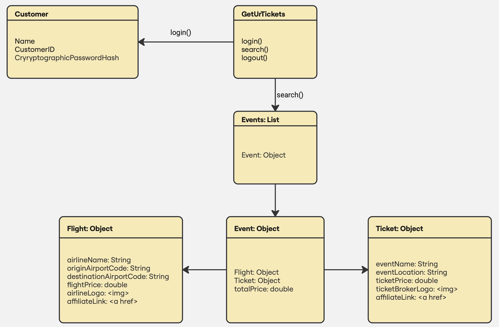

- [Get-Ur-Tickets](#get-ur-tickets)
- [Process to run it locally](#process-to-run-it-locally)
  - [Frontend](#frontend)
  - [Backend](#backend)
  - [Docker](#docker)
- [How the application works](#how-the-application-works)

# Get-Ur-Tickets
This is repository is for the CS 472 project.

# Process to run it locally
## Frontend
1. `npm install bootstrap react-bootstrap aws-amplify @aws-amplify/ui-react` - use this command to # get the dependancies to be able to start it.
   
2. `npm start`

### Frontend Optional: 
1. If using a Linux machine, or UNIX machines (needs testing), you may run `chmod +x build.sh` if you wish to use the build script instead. 

2. After enabling the build script for execution, run `./build.sh` in the root directory of your repo git clone.

3. This will run all necessary commands to build/aquire dependencies and prompt you to start the webserver locally if you wish.

## Backend
The entry point of the backend is [flask_app.py](./backend/flask_app.py)

1. Change directories to the backend directory: `cd backend`
2. Run `python3 flask_app.py`
3. Run this command: `curl -d '{"originAirportCode":"LAS"}' -X POST http://localhost:5000/test -H "Content-Type: application/json"`
   - If need be, edit the parameters passed by modifying what is inside the curly braces

You can expect the output to be in a JSON format like the following. 

````
{"result":[[429.78,"United States Grand Prix"],[940.72,"Las Vegas Grand Prix"],[1351.37,"Brazil Grand Prix"],[1629.88,"Mexican Grand Prix"],[1739.1,"Qatar Grand Prix"],[4285.76,"Abu Dhabi Grand Prix"]]}
````

## Docker
1. Commands to build and run 
   - To build the container issue the command `docker build -t get-ur-tickets-app .`
   - To run the container issue the command  `docker run -p 3000:3000 get-ur-tickets-app`
2. Build Phase:
   - When the Docker file is built it will do the following: 
   - Download the node.js 16 image
   - Create a working directory in the `/app` container
   - Copy the package.json files
   - Run `npm install` to install dependencies 
3. Run Phase:
   - When the Docker file is ran it will do the following:
   - Expose port 3000 in the container to port 3000 on your local machine
   - Start the Node.js application using npm start 
   - The application will be accessible on your local machine at `http://localhost:3000`
4. FAQ:
   - Ensure Docker is installed on your computer.
   - The initial build will take approximately 2 minutes.
   - If the build fails and the error you encounter is 401 unauthorized, make sure you are logged into Docker on your terminal. 
   - The command to log in is `docker login -u <username>`

# How the application works


GetUrTickets is a RESTful application that works by making GET, POST, PUT, and DELETE requests. The application has a frontend user interface that the user will interact with, and a backend that handles all of the processing of the application. The application will be hosted on Amazon Web Services using [AWS Amplify](https://aws.amazon.com/amplify/). The application will be deployed each time there is a new commit to our team repository.

Based on the diagram at the top. The user will request tickets for a specific (event) on the frontend. The backend will make an API call to SeatGeek for the upcoming events, which will then make an API call to SerpAPI for upcoming flight options based on the result from SeatGeek. After this, the backend will calculate each choice’s total price (tickets + flight), sort, and send the results to the frontend. The frontend will display the results and give the user the choice to filter. After this, the front end will provide the user an option to buy tickets through affiliate links so our application can receive a final payout.

The UML diagram below shows how the application works on a detailed level.

